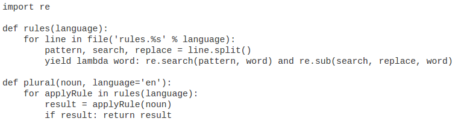

#Dive Into Python

##Chapter 1
nothing to say

##Chapter 2
###2.2 函数声明
1. Python既是*动态类型语言*(不使用显示数据类型声明)，又是*强类型语言*(需要明确的类型转换)

###2.3文档化函数

```python
    def function(para):
		"""this function aims to do
		something"""
```
doc string 必须是函数要定义的**第一个**内容
###2.4万物皆对象
1. 模块导入的搜索路径:sys.path;sys模块是用c写的
2. 函数也为对象，所有函数都有一个__doc__属性，返回doc string

###2.6测试模块

```python
	if __name__ == "__main__":
```
如果import模块，那么`__name__`的值通常为文件名，不带路径和扩展名；如果直接运行模块，则是`__main__`

##Chapter 3. 内置数据类型
###3.1 Dictionary
1. 无序
2. 大小写敏感
3. 混用数据类型

###3.2 List
1. 负数索引理解：`list[-n] == list[len(list) - n]`
2. 切片
3. 增加元素：append/insert/extend
	* extend与append区别：extend连接list,append插入任何值，就算是系数是list
4. 搜索：index/ `if 'c' in list`
5. 删除:remove() 一次删除一个/ pop()删除最后一个，并返回该值
6. list可以+ 和 *

###3.3Tuple
1. 一个Tuple即一个不可变list,支持分片
2. 没有index方法，有in查看元素是否存在
3. tuple速度比list快；对不需要改变的数据写保护；可以做dic的keys
4. 定义一个只有一个元素的tuple时，元素后的逗号是必须的

###3.4. 变量声明
1. 变量不需要显示声明，第一次赋值时产生。
2. 一次赋多值

###3.6映射list
`li = [elem*2 for elem in list]`

###3.7list连接与分割
1. jion只能用于元素是字符串的list
2. split,可选系数表分割次数

##Chapter 4自省的威力
自省是指代码可以查看内存中以对象形式存在的其它

###4.2 可选参数和命名参数
调用函数时唯一必须做的事情就是为每一个必备参数指定值 

###4.3内置函数
1. type
2. str() 强制转换成字符串， 可以作用于任何数据类型，甚至是None, 都能得到'None'
3. dir 函数返回任意对象的属性和方法列表
4. callable 函数，它接收任何对象作为参数，如果参数对象是可调用的，返回True，否则返回False
5. type,str等内置函数都包含在__buidin__这个特殊的模块中

###4.4 通过getattr获得对象引用
1. getattr(object, "attribute")等价于object.attribute;如果object是一个模块的话，那么attribute可能是定义在模块中的任何东西：函数、类或者全局变量；如果object是内置数据类型，得到的是方法
2. getattr作为一个分发者;statsout模块定义了三个函数:`output_html`,`output_text`,`output_xml`

```python
	import statsout
	def output(data, format="text"):
    	output_function = getattr(statsout, "output_%s" % format, statsout.output_text)
    	return output_function(data)
```
最后一个为getattr的可选参数，是一个缺省返回值

###4.5过滤列表
`[mapping-expression for element in source-list if filter-expression]`

###4.6 and 和 or 的特殊性质
1. 如果and逻辑演算的值为假，则返回第一个假值；如果为真，则返回最后一个真值
2. or返回第一个真值或者最后一个假值
3. and-or技巧： bool and a or b, 类似bool ? a : b,但如果a的值为假，则不会正确工作。安全工作方法：`(bool and [a] or [b])[0]

###4.7使用lambda函数
1. 可以将lambda赋予一个变量进行调用
2. lambda 函数在布尔环境中总是为真。(这并不意味这 lambda 函数不能返回假值。

`'some string'.ljust(spacing)` :ljust 用空格填充字符串以符合指定的spacing长度.

##第五章对象和面向对象
###5.3类的定义
1. 子类不会自动调用父类的方法，需要显示调用.__init__方法也是。  __init__方法从不返回一个值
2. self 必须作为每个方法的第一个参数

###5.4类的实例化
3. 创建一个实例只需要调用一个类就行。
4. 内存回收：引用计数变为0以后，python自动销毁实例;   ?循环引用问题？

###5.5 UserDic一个封装类
1. update:字典复制器,合并
2. python没有函数重载
3. 建议尽量在__init__方法中将所有的数据属性赋初值 
4. copy模块可以拷贝任何的python对象。在父类定义copy函数时，因为不知道时自己还是子类调用copy，所以得判断__class__。当时子类调用时，则用copy模块

###5.6专用类方法
1. 专用方法是在特殊情况下或当使用特别语法时由 Python 替你调用的:__getitem__/ __setitem__等;专用方法可以被子类覆盖
2. __repr__/__cmp__/__len__/__delitem__

###5.8类属性介绍
1. 一个类属性在任何实例之前就有效了。类属性既可以通过直接对类的引用，也可以通过对类的任意实例的引用来使用。
2. python中的类属性相当与java中的静态变量，数据属性相当与实例变量

###私有函数
1. python函数、类方法或者属性名字开头以两个下划线开头，但不是结束,则它是私有的。专有方法是公用的.
2. 严格的说， python的私有还是能被外部访问。

##第六章异常和文件处理
###6.1异常处理
1. try...except...[else...] try没有发生异常时，else里面的执行;raise 抛出异常;无论try还是except,finally:总是会执行的代码

###6.2 文件对象
1. open/file()返回一个对象。fd.tell()//tell()方法返回打开文件的当前位置

###6.4 sys.modules
1. python类都有一个内置的类属性 __module__, 它定义了这个类的模块的名字 

###6.5目录
1. os.path: join,expanduser,split,splitext(文件名和扩展名分开);path封装了平台之间的不同;isfile,isdir;normcase
2. os.listdir:返回目录内容的list
3. glob模块的glob方法支持通配符

##第7章正则表达式
1. re模块
2. 松散型正则表达式:忽略空白符and忽略注释(指的是传给search的pattern),并添加re.VERBOSE参数: re.search(pattern, string, re.VERBOSE)

##第8章HTML处理
###8.2 sgmllib.py介绍
1. SGMLParse类. SGMLParser将HTML分为:开始标记/结束标记/字符引用/实体引用/注释/处理指令/声明/文本数据
2. SGMLParse类只是一个消费者，只负责分解。应该定义其子类，定义相应的方法
3. python处理list比字符串快
4. locals 和globals: 命名空间; locals 返回的只是拷贝，而globals不是
5. 基于dictionary的字符串格式化
```python
	params = {'exam1':'ddd','exam2':'kkk'}
	print "%(exam1)s is %(exam2)s" % params
```
##第9章XML处理
1. 一个包是一个其中带有特殊文件__init__.py的目录;xml包有sax、dom、parsers包
2. unicode：指定编码保存.py文件,在开头`# -*-coding: UTF-8 -*-`
3. from xml.dom import minidom; getElementsByTagName();当你解析一个XML文档时，你得到了一组Python对象，它们代表XML文档中的所有片段，同时有些Python对象代表XML元素的属性。但是表示(XML)属性的(Python)对象也有(Python)属性，它们用于访问对象表示的(XML)属性。

##第10章脚本和流
1. StringIO模块允许将一个字符串转换为一个类文件对象,从而可以使用read,seek等方法
2. getopt模块处理命令行输入

##第11章 HTTP Web服务
1. HTTP的特性
	1. 用户代理
	2. 重定向:状态代码301永久重定向,302暂时重定向;同时都会在头部告知新地址
	3. Last-Modified/If-Modified-Since:状态304没有修改
	4. Etag/If-None-Match:实现与最近修改数据检查同样的功能;通过hash值
	5. 压缩
2. urllib2获取HTTP资源:1 获取request对象,接受URL;2创建一个URL开启器,它可以接受任何数量的处理器来控制响应的处理;使用创建的Request对象告诉开启器打开URL

##第12章SOAP Web服务
1. SOAP:[维基百科](http://zh.wikipedia.org/wiki/%E7%AE%80%E5%8D%95%E5%AF%B9%E8%B1%A1%E8%AE%BF%E9%97%AE%E5%8D%8F%E8%AE%AE)
2. WSDL:网络服务描述语言;在WSDL文件中描述了调用相应的SOAP网络服务的一切：
	* 服务 URL 和命名空间
	* 网络服务的类型 (可能是 SOAP 的函数调用，但我说过，WSDL 足够自如地去描述网络服务的广泛内容)
	* 有效函数列表
	* 每个函数的参数
	* 每个参数的类型
	* 每个函数的返回值及其数据类型
可以通过WSDL进行SOAP自省

##第13章单元测试
1. python的一个单元测试框架:unittest模块;编写测试用例的第一步就是继承unittest模块中的TestCase类;每个测试用例必须与其他隔离工作
2. 正面测试(Testing for success):assertEqual测试两个值是否相等
3. 负面测试(testing for failure):assertRaises 方法，它接受这几个参数：预期的异常、测试的函数，以及传递给函数的参数。
4. 完备性测试:例如互逆的转换函数时，测试不会出现精度丢失或者取整等错误

##第14章测试优先编码
1. 面的单元测试能够告诉你的最重要的事情是什么时候停止编写代码。当一个函数的所有单元测试都通过了，停止编写这个函数。一旦整个模块的单元测试通过了，停止编写这个模块。

##第15章重构
1. 处理bugs
2. 应对需求变化
3. 为改进性能、可伸缩性、可读性、可维护性和任何缺少的特征而无情地重构，全面的单元测试给你自由去重构
4. 简洁是美德

##第16章函数编程
1. 找到目录:os.getcwd()/os.path.abspath()
2. filter:接受两个参数:函数和一个列表(或者元组或者序列一样的对象，可能最新版本会有更新),返回一个列表(或者..)
3. map列表映射;能够处理混合型数据类型
```python
	li = [5, 'a', (2, 'b')]
	a = map(double,li)
```
`a = [10, 'aa', (2,'b',2,'b')]`
4. 数据中心编程思想
5. 动态导入模块:利用__import__函数:`sys = __import__('sys')`，相当于`import sys`

##第17章动态函数 
1. 生成器:代码示例

一般需要读取整个规则文件并在使用第一条规则之前构建一个所有规则组成的列表。现在有了生成器，你可以更舒适地做到这一切：你打开并读取第一条规则，根据它创建函数并使用之，如果它适用则根本不去读取规则文件剩下的内容，也不去建立另外的函数。

##第18章性能优化
1. timeit 计时工具
	1. timeit.Timer():两个字符串参数：要计时的语句和第一个参数语句构建环境的导入语句(如import)。因为timeit构建起一个独立的虚拟环境. 返回的是调用一百万次耗费的秒数
	2.  另外一个方法:repeat(test_times, call_times)
2. 优化正则表达式;优化字典查找;优化列表操作;优化字符串操作
3. 如果你要在正则表达式和编写循环间抉择，选择正则表达式。正则表达式因其是以 C 语言编译的可以本能地在你的计算机上运行，你的循环却以Python编写需要通过Python解释器运行。
4. 如果你需要在正则表达式和字符串方法间抉择，选择字符串方法。它们都是以C编译的，所以选取简单的。
5. 字典查找的通常应用很快，但是string.maketrans之类的特殊函数和isalpha()之类的字符串方法更快。如果Python有定制方法给你用，就使它吧！
6. 别太聪明了。有时一些明显的算法是最快的。不要太迷恋性能优化，性能并不是一切。
